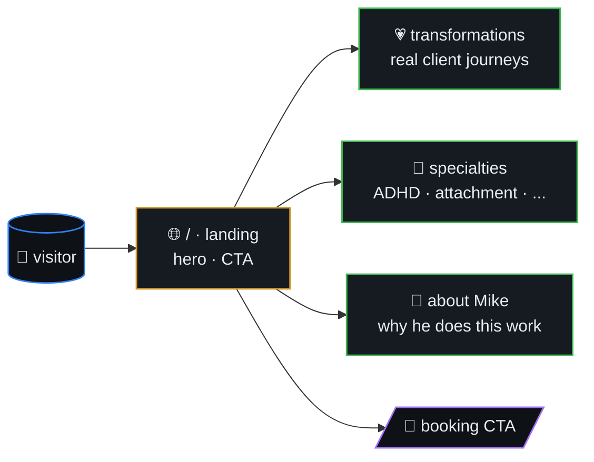
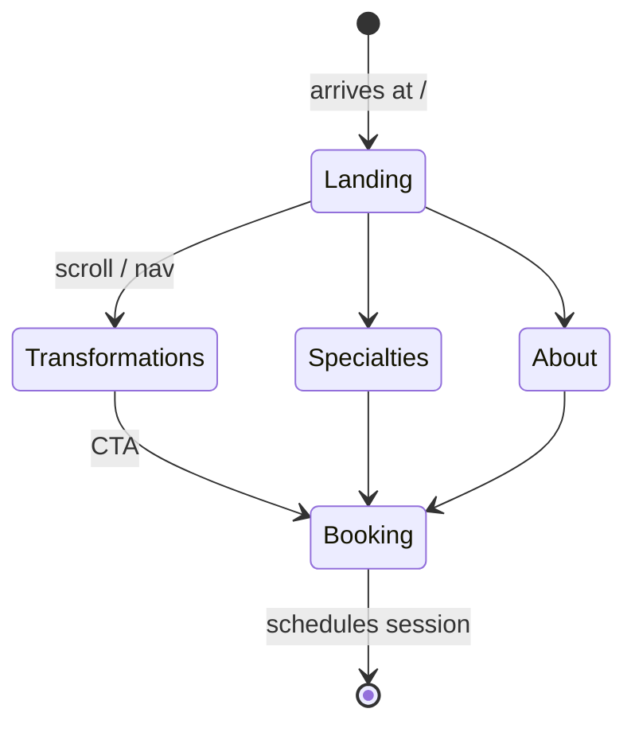
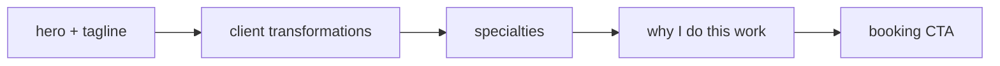
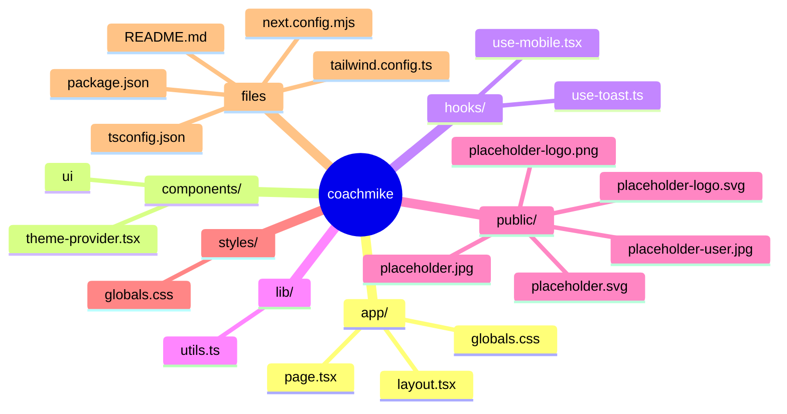
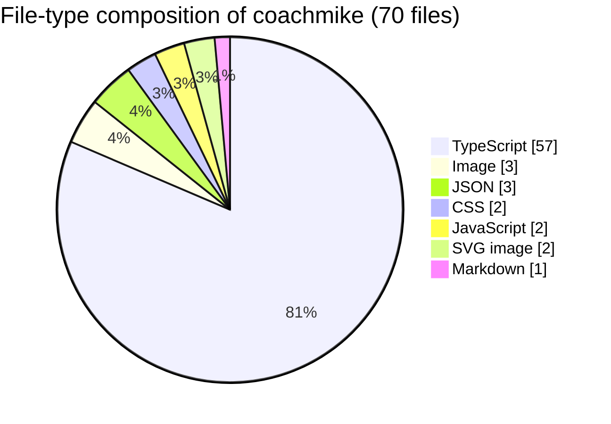

# Coach Mike

> Personal site for **Mike** — Relationship & Healing Coach. Showcases
> client transformations, therapy specialties, and lets visitors book
> a session.



## Table of contents

- [Stack](#stack)
- [Visitor journey](#visitor-journey)
- [Page sections](#page-sections)
- [Getting Started](#getting-started)
- [🗺️ Repository map](#️-repository-map)
- [📊 Code composition](#-code-composition)

## Visitor journey



## Page sections



## Stack

- Next.js (App Router) + React + TypeScript
- Tailwind CSS + shadcn/ui (Radix primitives)
- pnpm

## Getting Started

```bash
pnpm install
pnpm dev
```

Open [http://localhost:3000](http://localhost:3000). Edit `app/page.tsx`.


## 🗺️ Repository map

Top-level layout of `coachmike` rendered as a Mermaid mindmap (auto-generated from the on-disk tree).




## 📊 Code composition

File-type breakdown of source under this repo (skips `.git`, `node_modules`, build caches, lockfiles).


