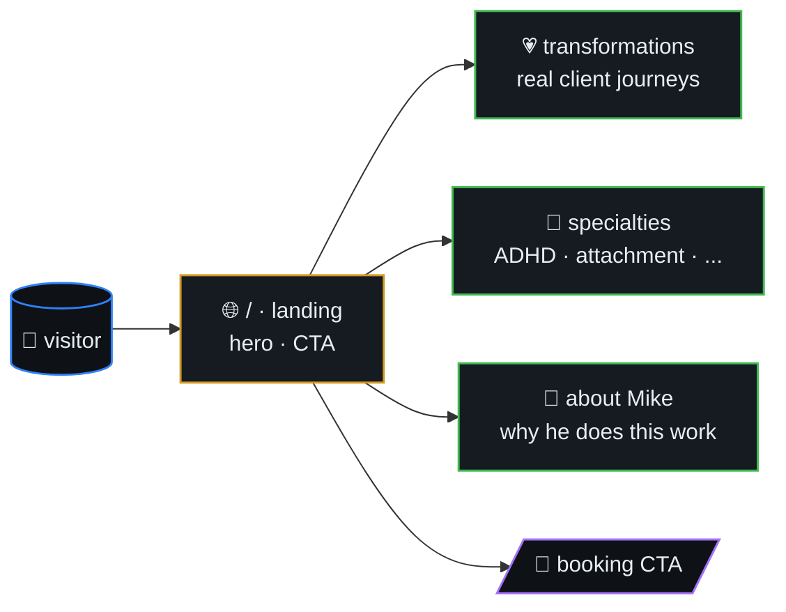

# Coach Mike

> Personal site for **Mike** — Relationship & Healing Coach. Showcases
> client transformations, therapy specialties, and lets visitors book
> a session.



## Table of contents

- [Stack](#stack)
- [Getting Started](#getting-started)

## Stack

- Next.js (App Router) + React + TypeScript
- Tailwind CSS + shadcn/ui (Radix primitives)
- pnpm

## Getting Started

```bash
pnpm install
pnpm dev
```

Open [http://localhost:3000](http://localhost:3000). Edit `app/page.tsx`.
